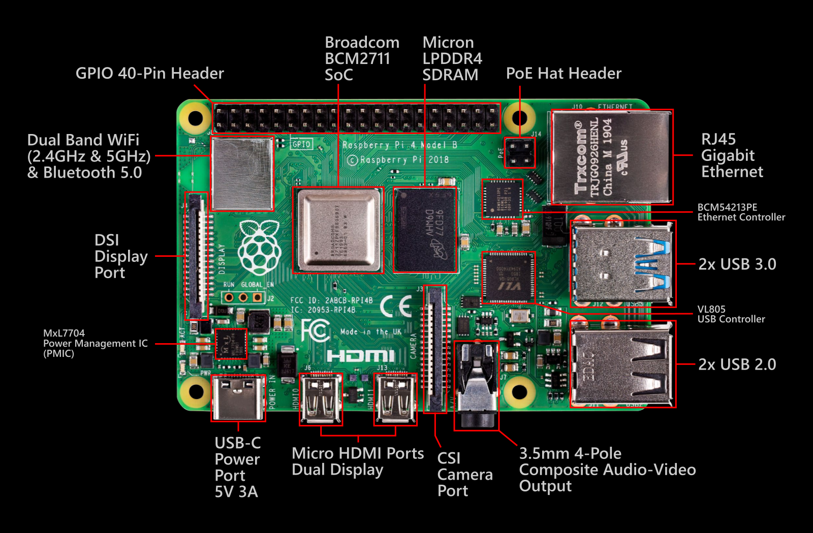
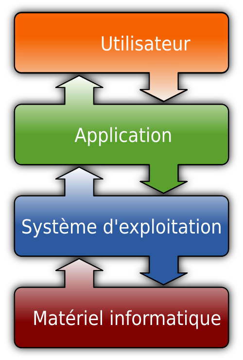

# Théorie sur l’usage du Raspberry Pi

Le premier appareil vu dans le cadre du cours est le Raspberry Pi 4 modèle B. C’est un petit ordinateur où tous les composants sont soudés au circuit imprimé. Son faible prix relativement à sa puissance et à sa facilité d’accès fait le bonheur des passionnés en tout genre.

## Spécifications techniques

<figure markdown>
  
  <figcaption>Le Raspberry Pi 4 modèle B</figcaption>
</figure>

Les spécifications techniques complètes du Raspberry Pi sont disponibles [ici](https://www.raspberrypi.com/products/raspberry-pi-4-model-b/specifications/).

Le Raspberry Pi 4B est muni d’un processeur ARM à 4 cœurs ainsi que de 4 Go de RAM, ce qui le rend assez puissant pour être utilisé comme ordinateur conventionnel. On peut aussi y mettre une carte microSD (généralement, ce stockage contiendra notre système d’exploitation et on pourra y stocker des fichiers de manière plus permanente).

En termes de connectivité réseau, le Raspberry Pi est muni d’une antenne intégrée qui lui donne des capacités de connexion sans fil, en plus d’un port Ethernet qui permet de le brancher directement à un routeur ou à un ordinateur.

Le Raspberry Pi est aussi muni de 40 ports GPIO, ce qui nous permet d’y connecter des composants électroniques avec lesquels on peut communiquer pour accomplir un ensemble de tâches limité uniquement par notre imagination et notre budget.

Bien d’autres ports sont disponibles. Nous vous encourageons à consulter les spécifications de la machine pour plus de détails.

## Système d’exploitation

<figure markdown>
  
  <figcaption>L'OS est une couche intermediaire</figcaption>
</figure>

Nativement, le Raspberry Pi n’a aucun système d’exploitation installé. Il faut donc installer soi-même un système d’exploitation que l’on monte sur une carte microSD à l’aide d’un logiciel comme Raspberry Pi Imager (rpi-imager). De manière générale, le système d’exploitation est chargé de gérer les ressources matérielles afin d’offrir une interface qui permet aux utilisateurs de ne pas avoir à se soucier de la couche matérielle de leur système. Par exemple, sur les systèmes modernes, un utilisateur n’a pas besoin de se soucier de savoir si son clavier ou sa souris vont fonctionner. Ce type de logiciel est plus communément appelé un « driver ».

Lorsqu’on charge l’image du système d’exploitation choisi sur une carte microSD, on remarque la présence de deux partitions : une partition `boot` ainsi qu’une autre partition au nom du système d’exploitation, souvent appelée `rootfs`. La partition `boot` contient les fichiers de démarrage et le firmware, aussi appelé chargeur d’amorçage, qui permettent de lancer le système d’exploitation. Cette partition contient un fichier extrêmement important, le fichier `config.txt`, qui permet de modifier l’interface matérielle/logicielle de notre système d’exploitation. On peut par exemple activer ou désactiver certaines interfaces (I2C, SPI, UART), régler la mémoire GPU, désactiver les ports USB, etc.

Dans le cas du Raspberry Pi, il y a un grand nombre de systèmes d’exploitation disponibles, dont certains pour des usages spécifiques. Par exemple, il y a des OS comme Raspberry Pi OS ou Ubuntu qui permettent d’utiliser le Raspberry Pi comme on utiliserait un ordinateur normal ; d’autres ont des usages spécialisés et permettent de transformer son Raspberry Pi en émulateur ou en routeur (vous pouvez explorer ces possibilités dans les menus du Raspberry Pi Imager).

En termes plus simples, le système d’exploitation vous permet de tirer profit de la puissance de votre Raspberry Pi. Il est donc primordial de choisir un système d’exploitation qui convient à la tâche que l’on désire accomplir.

